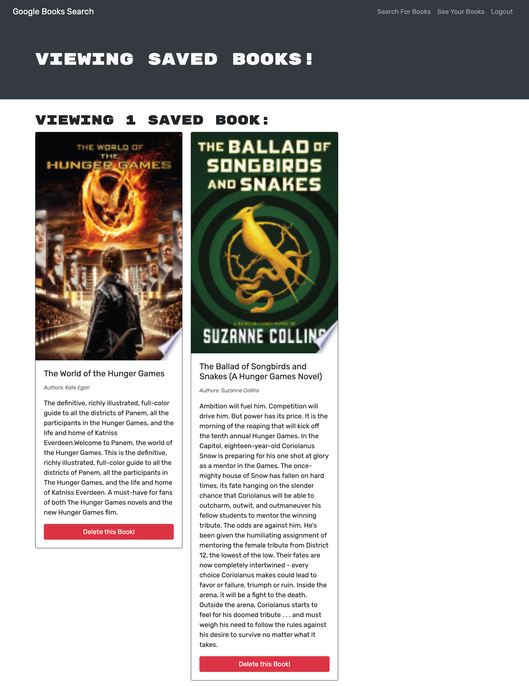

# Book Search Engine 

## Table of Contents 
1. [Description](#description)
2. [Visuals](#visuals)
3. [Resources](#resources)

## Author:

Safwan Islam

## Description
In this repository, a fully functioning Google Books API search engine built with a RESTful API was refactored to be a GraphQL API built with Apollo Server. The app was built using the MERN stack, with a React front end, MongoDB database, and Node.js/Express.js server and API. The apps functionality includes logging in or signing up. Then the user can save their searched books and also delete them from their "see your books" page. It is essentially a way for avid book-readers to have a place to store their favorite books.

## Visuals

## Resources
[LIVE SITE](https://floating-temple-87384.herokuapp.com/)

[Repository](https://github.com/saislam10/book-search-engine)
